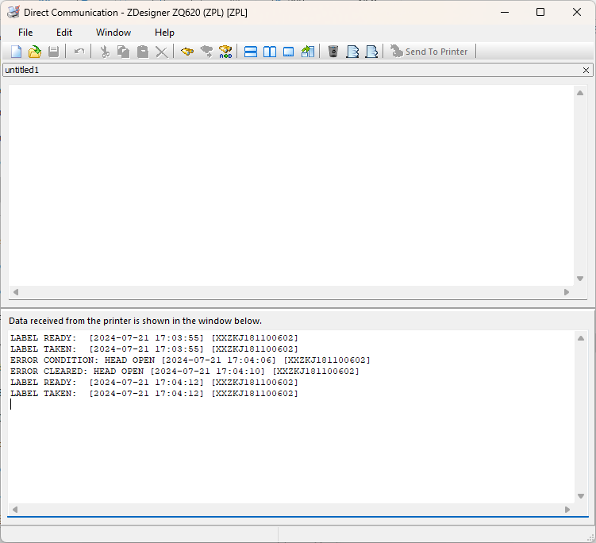

# Zebra-Printer_Link-OS_Add Alerts by SGD Alerts command
# アラート通知方法(alerts編)


</br>
</br>
</br>

^SX同様の機能を有するが下記の違いがある。
- より多くのイベントに対応
- より多くのI/Fに対応

</br>

### 利用可能なI/F

- SERIAL
- PARALLEL
- E-MAIL
- TCP
- UDP
- SNMP (v2C/v3)
- USB ★
- HTTP-POST ★
- BLUETOOTH ★
- SDK ★
- MQTT ★

[注意] USB-HOSTは非対応

</br>

### 設定方法

```
## ■ 設定
! U1 setvar "alerts.add" "ALL MESSAGES,SERIAL,Y,N,,0,N,"
! U1 setvar "alerts.add" "ALL MESSAGES,USB,Y,Y,,0,N,"


## ■ 確認
! U1 getvar "alerts.configured"
"SHUTTING DOWN,USB,Y,Y,,0,N,|ALL MESSAGES,SERIAL,Y,N,,0,N,"

## ■ 削除
! U1 setvar "alerts.add" "SHUTTING DOWN,USB,N,N,,0,N,"
! U1 getvar "alerts.configured"
"ALL MESSAGES,SERIAL,Y,N,,0,N,"
```

</br>

[設定項目の詳細はZPL2 コマンドリファレンスを参照のこと](https://www.zebra.com/content/dam/support-dam/en/documentation/unrestricted/guide/software/zpl-zbi2-pg-en.pdf)

</br>

#### デモ、アラート出力

```
^XA
^FO50,50^B3N,N,100,Y,N^FD123456^FS
^PQ2
^XZ

LABEL TAKEN:  [2024-07-17 14:36:16] [XXZKJ181100602]
LABEL READY:  [2024-07-17 14:36:17] [XXZKJ181100602]
LABEL TAKEN:  [2024-07-17 14:36:29] [XXZKJ181100602]
ALERT: PQ JOB COMPLETED [2024-07-17 14:36:30] [XXZKJ181100602]
LABEL READY:  [2024-07-17 14:36:30] [XXZKJ181100602]
LABEL TAKEN:  [2024-07-17 14:36:31] [XXZKJ181100602]
ERROR CONDITION: HEAD OPEN [2024-07-17 14:37:03] [XXZKJ181100602]
ERROR CLEARED: HEAD OPEN [2024-07-17 14:37:48] [XXZKJ181100602]
```

</br>

#### 例、USB接続

```
! U1 setvar "alerts.add" "ALL MESSAGES,USB,Y,Y,,0,N,"
```



</br>

#### 例、TCP: Port 9999

```
! U1 getvar "alerts.configured"
"COLD START,SNMP,Y,N,255.255.255.255,162,N,|ALL MESSAGES,SDK,Y,Y,WEBLINK.IP.CONN2,0,N,"

! U1 setvar "alerts.add" "ALL MESSAGES,TCP,Y,Y,192.168.4.133,9999,N,"

! U1 getvar "alerts.configured"
"COLD START,SNMP,Y,N,255.255.255.255,162,N,|ALL MESSAGES,SDK,Y,Y,WEBLINK.IP.CONN2,0,N,|ALL MESSAGES,TCP,Y,Y,192.168.4.133,9999,N,"
```

```
zebra@blacklily:~$ nc -l -p 9999 -k

エラーをクリア: ヘッド オープン [2024-08-06 05:52:25] [D7J203700352 (????????)]
アラート クリア: プリンタ ポーズ [2024-08-06 05:52:30] [D7J203700352 (????????)]
アラート: ジョブ完了 [2024-08-06 05:58:28] [D7J203700352 (????????)]
ラベル レディ:  [2024-08-06 05:58:29] [D7J203700352 (????????)]
ラベル剥離:  [2024-08-06 05:58:29] [D7J203700352 (????????)]
アラート: ジョブ完了 [2024-08-06 05:58:30] [D7J203700352 (????????)]
ラベル レディ:  [2024-08-06 05:58:30] [D7J203700352 (????????)]
ラベル剥離:  [2024-08-06 05:58:30] [D7J203700352 (????????)]
```

</br>

#### 例、UDP: Port 9999

```
! U1 setvar "alerts.add" "ALL MESSAGES,UDP,Y,Y,192.168.4.100,9998,N,"
```

```
pi@raspberrypi0:/var/log $ nc -l -u -p 9998 -k
LABEL TAKEN:  [2024-07-21 18:26:13] [XXZKJ181100602]
ERROR CLEARED: HEAD OPEN [2024-07-21 18:26:22] [XXZKJ181100602]
ERROR CONDITION: PAPER OUT [2024-07-21 18:26:23] [XXZKJ181100602]
```

</br>


#### 例、BLUETOOTH Classic

```
! U1 setvar "alerts.add" "ALL MESSAGES,BLUETOOTH,Y,Y,,0,N,"
! U1 getvar "alerts.configured"
"ALL MESSAGES,BLUETOOTH,Y,Y,,0,N,"
```

```
ALERT CLEARED: PRINTER PAUSED [2024-08-06 07:29:23] [D7J203700352 (????????)]
LABEL READY:  [2024-08-06 07:29:23] [D7J203700352 (????????)]
LABEL TAKEN:  [2024-08-06 07:29:23] [D7J203700352 (????????)]
LABEL READY:  [2024-08-06 07:29:23] [D7J203700352 (????????)]
LABEL TAKEN:  [2024-08-06 07:29:23] [D7J203700352 (????????)]
ERROR CONDITION: HEAD OPEN [2024-08-06 07:29:23] [D7J203700352 (????????)]
ALERT: PRINTER PAUSED [2024-08-06 07:29:23] [D7J203700352 (????????)]
```
